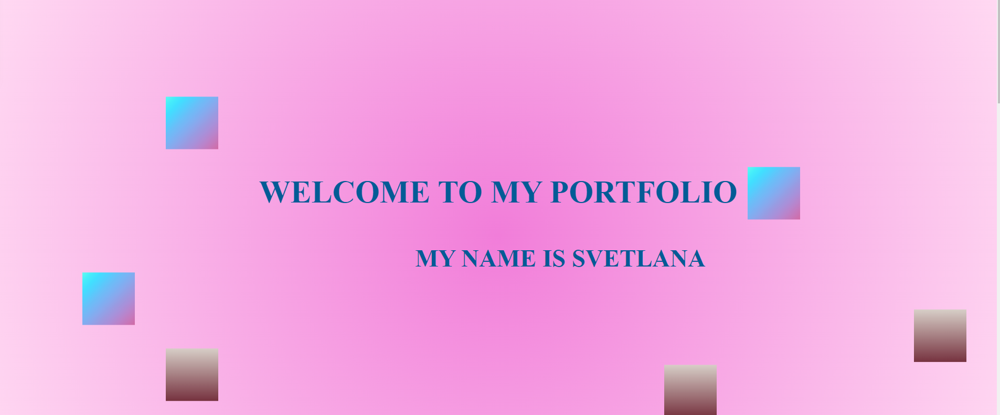
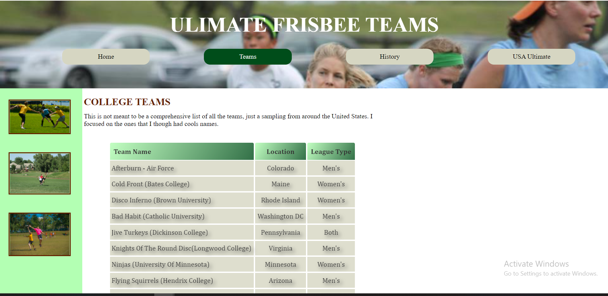

# Build a Personal Portfolio Webpage

This is a solution to the [Build a Personal Portfolio Webpage](https://my-portfolio-hollyy.netlify.app/).
FreeCodeCamp projects help you improve your coding skills by building realistic projects.

## Table of contents

- [Overview](#overview)
  - [Screenshot](#screenshot)
  - [Links](#links)
- [My process](#my-process)
  - [Built with](#built-with)
  - [What I learned](#what-i-learned)
  - [Continued development](#continued-development)
- [Author](#author)

## Overview

This project should have:

- At least one media query
- The height of the welcome section should be equal to the height of the viewport
- The navbar should always be at the top of the viewport.
- Few sections, where would be given information about me, contact, pictures and links to projects

What I added:

- It's CSS animation, Ive never used before.

### Screenshot



### Links

- Solution URL: [https://github.com/Holllyyyy/my-portfolio](https://github.com/Holllyyyy/my-portfolio)
- Live Site URL: [https://my-portfolio-hollyy.netlify.app/](https://my-portfolio-hollyy.netlify.app/)

## My process

I started with writing HTML5 where I added nav-bar with links to sections. Than I made three sections. I added divs, and classes because I wanted in the first section to make animation with six boxes, to move top bottom,bottom top.

```html
<section id="welcome-section">
  <div class="welcome-container">
    <div class="text"><h1>Welcome to my portfolio</h1></div>
    <div class="textn"><h3>My name is Svetlana</h3></div>
    <div class="boxf"></div>
    <div class="boxs"></div>
    <div class="boxt"></div>
    <div class="boxft"></div>
    <div class="boxff"></div>
    <div class="boxfs"></div>
  </div>
  <!---This is how I made it---->

  <!--In this section I added photos and links of my projects, and  used figure and figcaption for better accessibility and semantic HTML5--->
  <section id="projects">
    <h2 class="project-tile">My projects</h2>
    <div class="wrapper">
      <figure class="container">
        
        <figcaption>
          <a
            href="https://quirky-austin-45ff3b.netlify.app/index.html"
            class="a"
            target="_blank"
            >First website Frisbee and teams</a
          >
        </figcaption>
        <!---In the contact section I used font awesome icons and linked it to few websites, I used target blank so it will open on the other page.--->
        <section id="contact">
          <div class="contact-section">
            <h2 class="headtext">Let's work together</h2>
            <h3>Contact me</h3>
          </div>
          <div class="contact-container">
            <div class="contact">
              <i class="fa fa-github" style="font-size: 36px"></i>
              <a
                href="https://github.com/Holllyyyy"
                target="_blank"
                class="profile-link"
                id="profile-link"
                >Github</a
              >
            </div>
          </div>
        </section>
      </figure>
    </div>
  </section>
</section>
```

After it I moved on my style. I make css folder, and wrote CSS3.
Some new stuff I've done:

```css
nav {
  background: #48adf1;
  width: 100%;
  height: 80px;
  display: flex;
  align-items: center;
  position: sticky;
  top: 0;
  z-index: 999;
} /*navigation, background color, width of 100% for whole width, postion 0 so whenever we scroll nav will be fixed on top- This is how I made the navbar to be always at the top of the viewport.*/

nav > ul {
  width: 100%;
  display: flex;
  justify-content: flex-end;
  list-style-type: none;
  margin-left: 3%;
} /*nav here is parent and ul children,so whats done here is just top right sections, nav, with margin left who gives spaces, list-style-type none for no lists in nav bar*/

.nav-link {
  display: block;
  text-decoration: none;
  color: #ffffff;
  font-weight: bolder;
  text-transform: uppercase;
  padding: 2rem;
  font-family: "Courier New", Courier, monospace;
} /*nav link to be on display block, so will take one block for itself, n much easier later for style*/
.nav-link:hover {
  background-color: rgb(137, 119, 236);
  cursor: pointer;
  transition: 2s linear;
} /*hover for nav link so whenever we hover with mouse, will be changed color n transtion of 2 s*/
#welcome-section {
  width: 100%;
  background: rgb(241, 125, 217);
  background: radial-gradient(
    circle,
    rgba(241, 125, 217, 1) 0%,
    rgba(255, 217, 242, 1) 100%
  );
  color: #035b96;
  height: 100vh;
  text-transform: uppercase;
  font-weight: bolder;
  font-size: 2rem;
  font-family: Verdana, Geneva, Tahoma, sans-serif;
} /*this is the first section, where is used gradient as a background color. In this section I had to use height of 100vh, that was required for this project*/
h1 {
  text-align: center;
} /*every h1 will be aligned on center*/

.welcome-container {
  display: grid;
  height: 100%;
  grid-template-columns: repeat(12, 1fr);

  grid-template-areas:
    ". . b . . . . . . . . ."
    ". . . . . . . . . c . ."
    ". . . . . . . . . . . ."
    ". . . . . . . . . . . ."
    ". f . a a a a a a . . ."
    ". . . . . g g g g g . o"
    ". . . . . . . . . . . ."
    ". . d . . . . . e . . ."
    ". . . . . . . . . . . ."
    ". . . . . . . . . . . ."
    ". . . . . . . . . . . ."
    ". . . . . . . . . . . .";
} /* In this container, I used grid, grid template columns repeat(12,1fr) so later in the grid-template-areas when I wrote repeat (12,1fr)
I needed to write 12 times inside grid-template-areas for positining. Each time I used something, i needed 12 times. I wanted some spaces , so for it I used '.' But always what I needed to be careful is to use it 12 times.  So here I wrote how I want my boxes to be presented on the page.

*/

.text {
  grid-area: a;
} /* here I am just giving grid area sign , what I applied in grid-template-areas, so my text 'Welcome to my portfolio is actually there a a a a a*/
.textn {
  grid-area: g;
}

.boxf {
  height: 80px;
  width: 80px;
  background-image: linear-gradient(
    to left top,
    #d16ba5,
    #c777b9,
    #ba83ca,
    #aa8fd8,
    #9a9ae1,
    #8aa7ec,
    #79b3f4,
    #69bff8,
    #52cffe,
    #41dfff,
    #46eefa,
    #5ffbf1
  );
  grid-area: f;
  animation: top-bottom 3s infinite alternate linear;
} /*6 boxes are in this welcome section, I used animation, where always first is name what we can put whatever we want to, then second, infinite
saying dont stop keep going, keep moving*/
@keyframes top-bottom {
  from {
    transform: translateY(0);
  }
  to {
    transform: translateY(300px);
  }
} /*to be able to use animation,we need keyframe with same name as we named earlier in our animation,and here is from place we wanna start to other place
i use translateY cause I want them to move up down*/
#projects {
  width: 100%;
  display: grid;
  background-color: #ffffff;
} /*use of grid, for section projects*/
.project-tile {
  animation: left-right 4s alternate ease-in-out;
  margin-top: 4%;
  color: #48adf1;
  font-size: 2rem;
  font-weight: bold;
  text-transform: uppercase;
  font-family: "Courier New", Courier, monospace;
} /* here is project title, where is used animation to go right n back, when we reload page because I still dont know anything about java script so I cant really make when I move to this section to move left right*/
@keyframes left-right {
  from {
    transform: translateX(0);
  }
  to {
    transform: translateX(200px);
  }
}
/*here, is translateX, whats giving other direction then earlier, n goes right n back*/

.wrapper > figure > img {
  width: 100%;
  height: 100%;
  object-fit: cover;
  animation: right-left 4s alternate ease-out;
  box-shadow: 5px 10px 18px #48adf1;
  -moz-box-shadow: 5px 10px 18px #48adf1;
  -webkit-box-shadow: 5px 10px 18px #48adf1;
  border: 1px solid #48adf1;
  border-radius: 20px 20px 0 0;
  -moz-border-radius: 20px 20px 0 0;
  -o-border-radius: 20px 20px 0 0;
  -webkit-border-radious: 20px 20px 0 0;
}
/*this is pictures of projects , where is used also animation, a little box-shadows, border-radius and so on, width n height is 100% cause img is child of wrapper*/

.wrapper {
  display: grid;
  grid-gap: 4rem;
  grid-template-columns: repeat(auto-fit, minmax(320px, 1fr));
  width: 100%;
  max-width: 100%;
  max-width: 1280px;
  margin: 0 auto;
  margin-bottom: 6rem;
} /*for this I used  display grid on 5 images I put there, with grid template columns repeat auto-fit,minmax(.,.) where without auto-fit n minmax would not be
able to get what i wanted at first, with margin of 0 auto, i centered all pics on mid,grid gap i made space between them, I ran into problem at first here, becayse I didnt use auto-fit, but after I used it all become good. Second problem wht I faced was all my pictures, havent looked so good, so I needed to find way how to center them.*/
figcaption {
  text-align: center;
  width: 100%;
  height: 20px;
  background-color: #48adf1;
  display: block;
  animation: right-left 4s alternate ease-out;
  font-weight: bold;
  font-family: "Courier New", Courier, monospace;
  box-shadow: 5px 10px 18px #48adf1;
  border: 1px solid #48adf1;
  border-radius: 0 0 20px 20px;
  -moz-border-radius: 0 0 20px 20px;
  -o-border-radius: 0 0 20px 20px;
  -webkit-border-radious: 0 0 20px 20px;
} /*figcaption desribe what is on pics, width of 100% n centered just for a better look, so lil heigh, also animation here,as
all pics n project tittle,n box shadow,border radius and so on */

}

```

### Built with

- Semantic HTML5 markup
- CSS custom properties
- CSS Grid
- CSS Flexbox
- CSS Animations

### What I learned

While working on this project I learned :

- how to set nav bar to be on top left of the viewport
- to connect nav bar with all section when its being clicked
- how to write GRID template areas and use it
- how to use animations

### Continued development

I will continue next with a course from Coursera Web Design for Everybody: Basics of Web Development & Coding Specialization. I want to practice and improve my HTML5 and CSS3 skills and learn about Java Script and Responsive Design.

## Author

- Website - [Svetlana Jokic](https://my-portfolio-hollyy.netlify.app/)
- Frontend Mentor - [@Holllyyyy](https://www.frontendmentor.io/profile/Holllyyyy)
- Twitter - [@svetlanajokic](https://twitter.com/svetlanajokic)
- LinkedIn - [@Svetlana Jokic](https://www.linkedin.com/in/svetlana-jokic-787432100/)
- FreeCodeCamp - [@hollyy](https://www.freecodecamp.org/hollyy)
